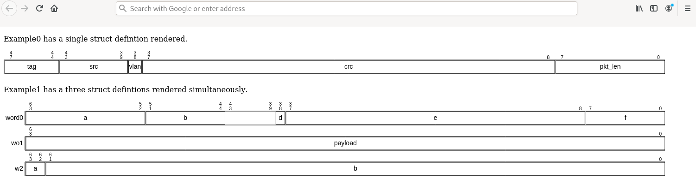

struct-canvas
=============

Draw representations of SystemVerilog structs in HTML canvas.

This work should be considered exploratory and not robust for production.

The [wavedrom project](https://github.com/wavedrom/wavedrom#server) is capable of generating register diagrams similar to struct-canvas. All future development of this project should move towards enhancing wavedrom as it is a more robust system.
